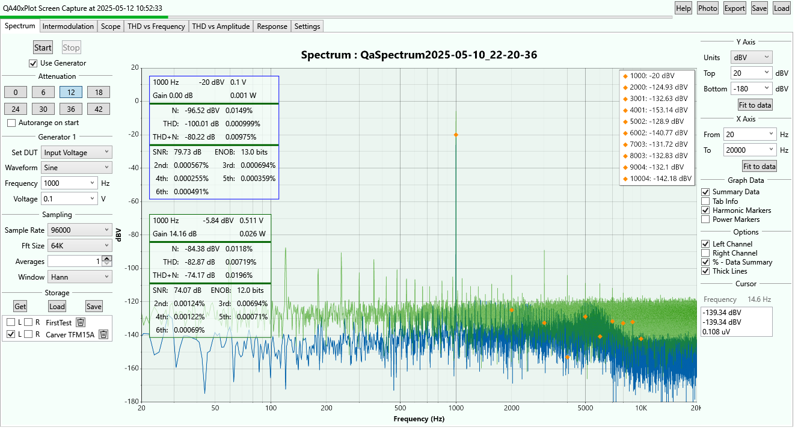

QA40xPlot

This application is a loose Fork of https://github.com/breedj/qa40x-audio-analyser, an excellent Windows Forms application
that interfaces with the QA40x audio analyser.

The changes here are twofold. First, it is using WPF instead of Windows Forms. Second, it contains an additional plot called
Spectrum that is the usual QA40x spectral power plot but with a simpler user interface.

The Release is currently a ZIP file with the entire build folder. Unzip it anywhere and run the QA40xPlot.exe file.

