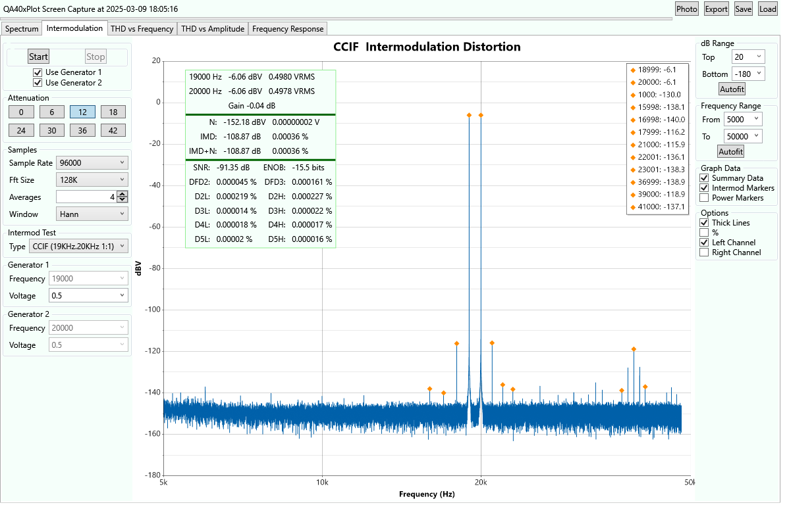
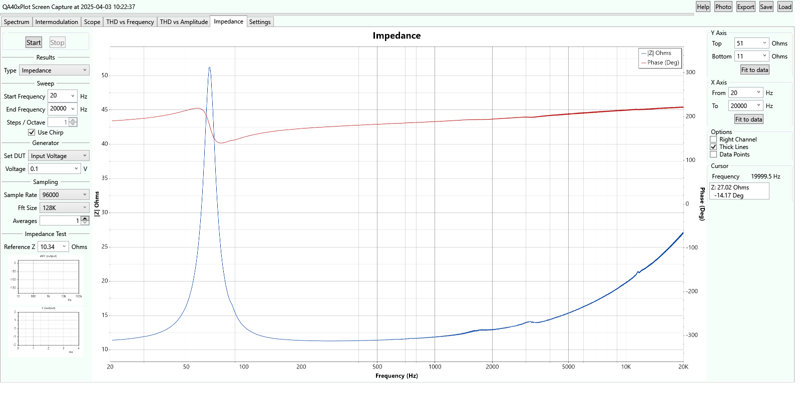

QA40xPlot

This Audio Analysis application is a loose Fork of https://github.com/breedj/qa40x-audio-analyser, an excellent Windows Forms application
that interfaces with the QuantAsylum QA40x audio analyser.

The analyzer contains 

- a spectral plot
- an intermodulation distortion plot
- a frequency response analyzer
- a chart of THD vs Frequency 
- a chart of THD vs Amplitude.
- an impedance (amplitude and phase) vs frequency sweep
- a bode plot (swept gain and phase)

The spectral and intermodulation tests include an option for autoranging. The THD vs xx plots autorange.

The code is based on C# and WPF (Windows Presentation Foundation).

Before starting this application, first start the QA40x program. Minimize it if you want, but it is used for the
REST interface. 

The Release is currently a .msi file that just needs to be executed. For now it is missing
the needed signature so the download has to be *kept*. This is next on the list.

At startup the program looks in your My Documents folder (usually \Users\yourname\Documents) and if it finds 
a saved configuration file named QADefault.cfg then that file is loaded.

Three tests: impedance testing, frequency response, and gain (bode plot) are wrapped in a single tab whose name
will dynamically change between the 3 (Impedance, Response, Gain) based on your selection in the tab.

**The impedance test** assumes the DUT is connected in series with a reference resistor. 

* The base of the DUT is ground, 
* the top of the DUT goes to the left channel and the bottom of the reference resistor
* the top of the reference resistor goes to both the input and the right channel.

**The Gain test** assumes the reference is connected to the right channel and the signal with gain is connected to the left channel.

This next image is an impedance test of a Dayton Audio SIG-150 loudspeaker. 
See here: https://www.parts-express.com/pedocs/specs/295-652--dayton-audio-sig150-4-spec-sheet.pdf

