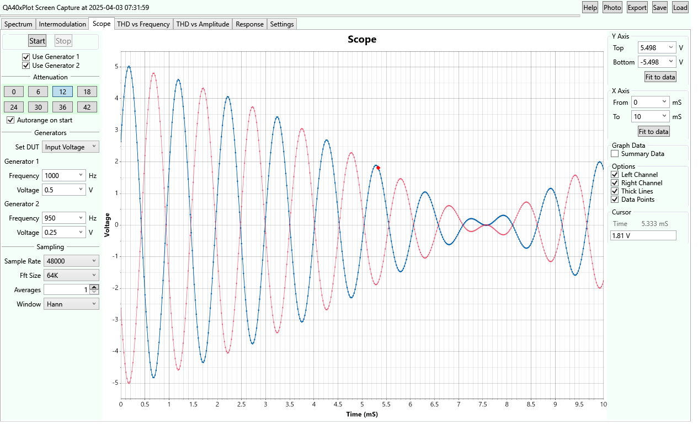
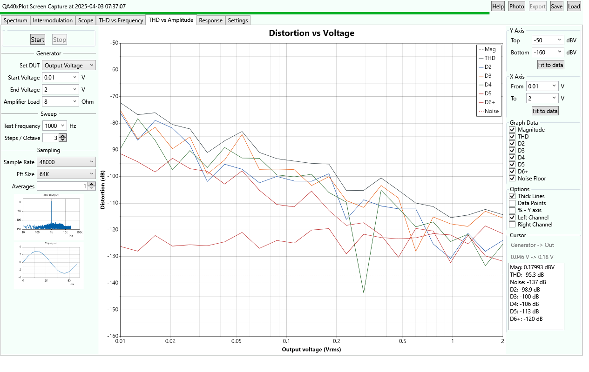

QA40xPlot

QA40xPlot is an Audio Analysis application designed around the QuantAsylum QA40x Audio Analyzer series
of hardware. 

- It takes advantage of the QA40x absolute voltage readout. 
- Tests may be autoranged by using app control of the attenuator.
- Tests are specified by QA40x generator voltage or DUT output voltage or DUT output power.

This Audio Analysis application is a loose Fork of https://github.com/breedj/qa40x-audio-analyser.

## Overview

The analyzer contains 

- a spectral sweep
- an intermodulation distortion test
- a simple oscilloscope for time domain results
- a frequency response analyzer
- a THD vs Frequency sweep
- a THD vs Amplitude sweep
- an impedance vs frequency sweep with amplitude and phase
- a bode plot sweep (swept gain and phase)

## Code
The code is based on C# and WPF (Windows Presentation Foundation).

## Documentation
There is a help button in the application that brings up a page of help.

## To Run

The Release is delivered as a zipped signed .msi setup program that just needs to be executed. Ignore the security warning (click More Info).

Before starting this application, first start the factory QA40x program. Minimize it if you want, but it is used for the
REST interface. It's tempting, but please avoid clicking the QA40x program GUI during QA40xPlot tests.

### Default Configuration

**At startup** the program looks in your My Documents folder (usually \Users\yourname\Documents) and if it finds 
a saved configuration file named **QADefault.cfg** then that file is loaded.

## General Info

The spectral and intermodulation tests include an option for autoranging. The THD vs xx plots autorange.

Three tests: impedance testing, frequency response, and gain (bode plot) are wrapped in a single tab whose name
will dynamically change between the 3 (Impedance, Response, Gain) based on your selection in the tab.

**Cursors** are visible in the lower right of the screen, below graph options. When you move the mouse in the window
the cursor values will track the displayed data. Click the mouse to stop changing frequency (fixing the value unless the program runs
continuously). Click the mouse again to release the hold.

## Impedance and Gain Test Connection
**The Impedance Test** assumes the DUT is connected in series with a reference resistor. 

* The base of the DUT is ground, 
* the top of the DUT goes to the left channel and the bottom of the reference resistor
* the top of the reference resistor goes to both the input and the right channel.

**The Gain Test** assumes the reference is connected to the right channel and the signal with gain is connected to the left channel.

## Photos
Spectral Plot

Intermodulation Distortion Test

Oscilloscope Plot

Distortion vs Frequency Test

Distortion vs Amplitude Test

Impedance Test

__note__: The impedance test above is a free-air plot of a Dayton Audio SIG-150 loudspeaker. 
See here: [SIG-150 specs.](https://www.parts-express.com/pedocs/specs/295-652--dayton-audio-sig150-4-spec-sheet.pdf)
