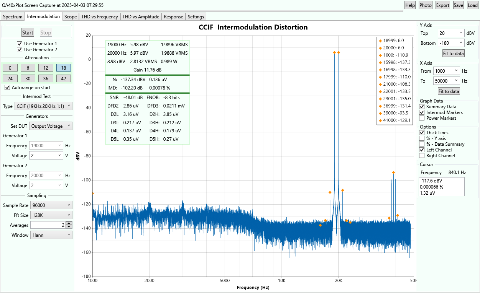

QA40xPlot

This Audio Analysis application is a loose Fork of https://github.com/breedj/qa40x-audio-analyser, an excellent Windows Forms application
that interfaces with the QuantAsylum QA40x audio analyser.

The analyzer contains 

- a spectral plot
- an intermodulation distortion plot
- a frequency response analyzer
- a chart of THD vs Frequency 
- a chart of THD vs Amplitude.

The code is based on C# and WPF (Windows Presentation Foundation).

Before starting this application, first start the QA40x program. Minimize it if you want, but it is used for the
REST interface. 

The Release is currently a ZIP file with the entire build folder. Unzip it anywhere and run the QA40xPlot.exe file.

