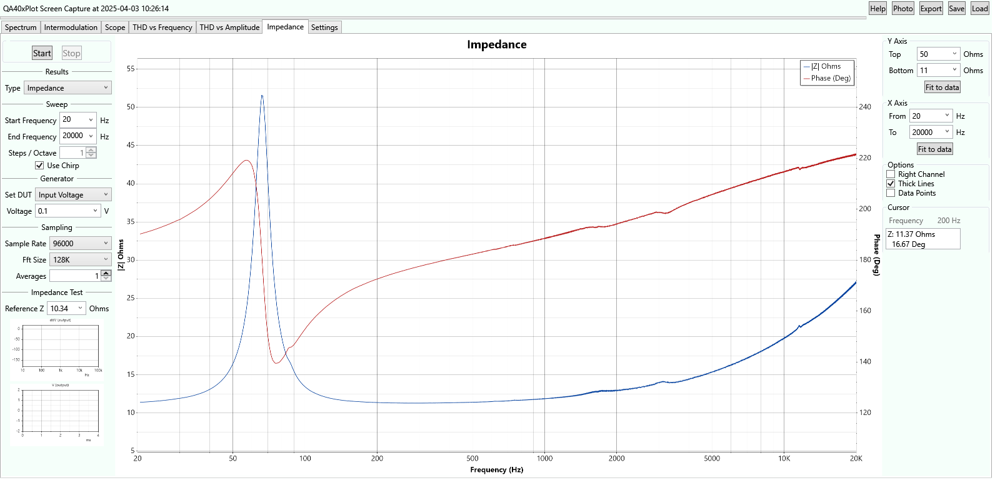

# QA40xPlot
## Summary
QA40xPlot is an Audio Analysis application designed around the QuantAsylum QA40x Audio Analyzer series
of hardware. 

- It takes advantage of the QA40x absolute voltage readout. 
- Tests may be autoranged by using app control of the attenuator.
- Tests are specified by QA40x generator voltage or DUT output voltage or DUT output power.
- Test results can be saved and then later loaded or used as chart overlays.
- External (sound device) generators such as DACs may be used/tested instead of the QA40x generator.

This Audio Analysis application started as a Fork of https://github.com/breedj/qa40x-audio-analyser.
Some code was borrowed from QuantAsylum's Qa40x_BareMetal and PyQa40x repositories on Github.

## Installation
The installer may be run from https://mzachmann.github.io. Once installed, copy the desktop icon to the taskbar if you wish
to pin it there.

## Known Problems
If you switch test type in the Response/Impedance/Gain tab the data will persist (so you may switch back)
but the graphical view is unlikely to be right for this other test. Rerun the test if you switch types.

## Overview
The analyzer contains 

- a spectral sweep
- an intermodulation distortion test
- a simple oscilloscope for time domain results
- a frequency response analyzer
- a THD vs Frequency sweep
- a THD vs Amplitude sweep
- an impedance vs frequency sweep with amplitude and phase
- a bode plot sweep (swept gain and phase)
- a crosstalk test

## Code
The code is based on C#, .NET 9, and WPF (Windows Presentation Foundation).

## Documentation
There is a help button in the application that brings up a page of help. 

There is also a lengthy but good youtube tutorial. The video tutorial has a 
clickable table of contents in the description.

## To Run
The installer creates an icon on your desktop and links to the usual Windows run options. 
The program is self-updating. It checks for updates each time it is run.

### USB Direct
This program is totally standalone and requires only that the Qa40x hardware is connected to the PC via USB. 
The program should automatically find the QA40x hardware and connect to it.

The USB connection is active only once a test is run.

If you experience issues with the USB connection, which is dependent on things like CPU performance, then
there is a setting to use the REST interface provided by the QA40x factory application.

### Default Configuration
**At startup** the program looks in your My Documents folder (usually \Users\yourname\Documents) and if it finds 
a saved configuration file named **QADefault.cfg** then that file is loaded.

The configuration can be autosaved on exit so it always has your last settings.

## General Info
The spectral and intermodulation tests include an option for autoranging. Most other tests automatically autorange.
The autorange safety margin is adjustable.

Four tests: impedance testing, frequency response, gain (bode plot), and crosstalk are wrapped in a single tab 
whose name dynamically changes between the 4 (Impedance, Response, Gain, Crosstalk) based on your selection in the tab.

**Cursors** are visible in the lower right of the screen, below graph options. When you move the mouse in the chart window
the cursor values track the mouse location. Click the mouse to stop changing frequency (fixing the value unless the program runs
continuously). Click the mouse again to release the hold.

## Impedance and Gain Test Connection
**The Impedance Test** assumes the DUT is connected in series with a reference resistor. 

* The base of the DUT is ground, 
* the top of the DUT goes to the left channel and the bottom of the reference resistor
* the top of the reference resistor goes to both the input (QA40x generator output) and the right channel.

**The Gain Test** assumes the reference (QA40x generator output) is connected to the right channel and the signal with gain 
(DUT output) is connected to the left channel.

**The Crosstalk Test** requires that you connect one signal to DUT left and right channels then
connect the output channels of the DUT to each QA40x input channel.

## Photos
Spectral Plot

Intermodulation Distortion Test

Oscilloscope Plot

Distortion vs Frequency Test

Distortion vs Amplitude Test

Frequency Response Test

Impedance Test

__note__: The impedance test above is a free-air plot of a Dayton Audio SIG-150 loudspeaker. 
See here: [SIG-150 specs.](https://www.parts-express.com/pedocs/specs/295-652--dayton-audio-sig150-4-spec-sheet.pdf)
